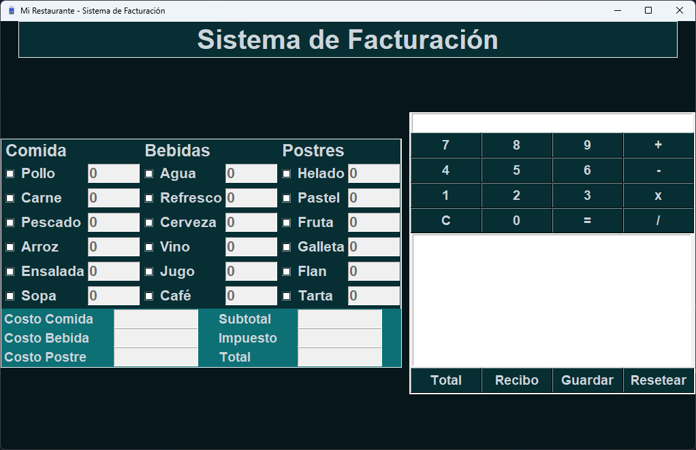
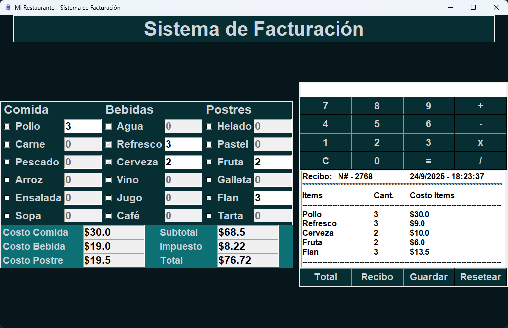

# Sistema de Facturación - Mi Restaurante
Este es un sistema de facturación simple para un restaurante, desarrollado en Python utilizando el módulo tkinter para generar las interfaces gráficas. Permite gestionar productos, generar facturas y calcular totales.

